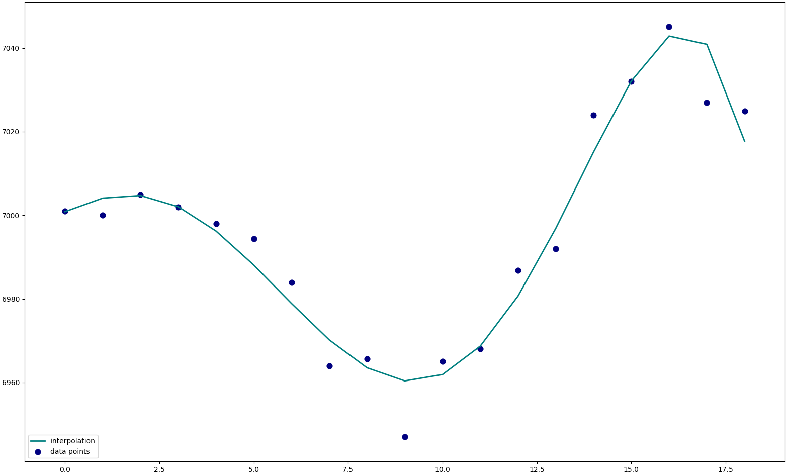

# LSTM-Cryptonalysis
The goal of this project is predicting the price trend of Bitcoin using an lstm-RNN. Technical analysis is applied to historical BTC data in attempt to extract price for automated trading. 

## Label
The price of Bitcoin tends to be very volatile and sporadic making it difficult to find underlying trends and predict price reversals. In order to smooth the historical price data without introducing latency, a [Savitzky-Golay filter](https://docs.scipy.org/doc/scipy-0.16.1/reference/generated/scipy.signal.savgol_filter.html) is applied. The purpose of this filter is to smooth the data without greatly distorting the signal. The first-order derivative is then taken to find the slope of the filtered data to indicate upwards and downwards movements about the zero axis. This can be seen in the following figure:    
     

    
## Features
The following features will be used for the lstm-RNN

* MACD histogram
* Stochastic RSI
* Volume
* Interpolation of price
    
   

An approximation of the next price is performed using ridge regression from Scikit-learn. Through polynomial interpolation, the price can be treated as a continuous function and the next value in a series can be approximated. 

The interpolation function fits the data and returns the next point on the polynomial function. This approximated value will be fed into the network along with the other features to predict the output label.

## Results
The results so far are somewhat promising. The accuracy of the network is just above 70% which can be helpful in market analysis but cannot be used for automated trading. Adding features and have better training data should improve the model. Future iterations of the project will include more robust technical analysis
    
      

*All code developed by Kurtis Streutker*
   