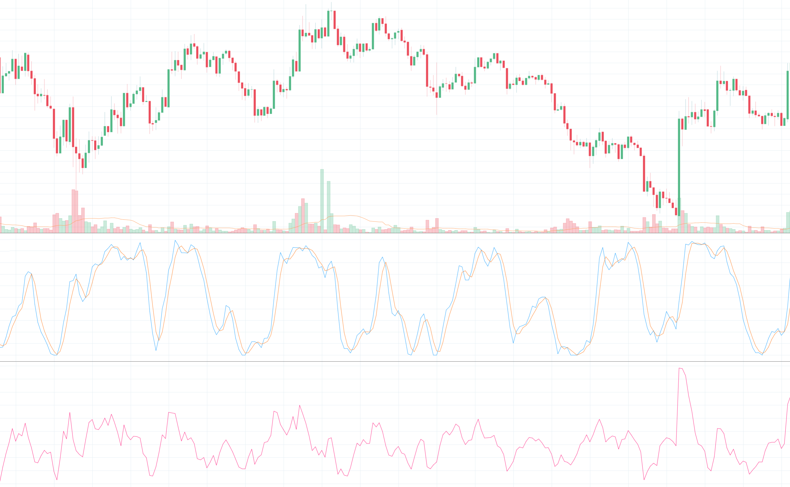

# LSTM-Cryptonalysis
The goal of this project is predicting the price trend of Bitcoin using an lstm-RNN. Technical analysis is applied to historical BTC data in attempt to extract price action for automated trading. The output of the network will indicate and upward or downward trend regarding the next period and will be used to trade Bitcoin throught the Binance API.

### requirements
* [python-binance](https://github.com/sammchardy/python-binance)
* Keras (RNN)
* Scikit (polynomial interpolation)
* numpy
* scipy (savgol filter)
* plotly and matplotlib (if designated graphing flag is set)

## Label
The price of Bitcoin tends to be very volatile and sporadic making it difficult to find underlying trends and predict price reversals. In order to smooth the historical price data without introducing latency, a [Savitzky-Golay filter](https://docs.scipy.org/doc/scipy-0.16.1/reference/generated/scipy.signal.savgol_filter.html) is applied. The purpose of this filter is to smooth the data without greatly distorting the signal. This is done by fitting sub-sets of adjacent data points with a low-degree polynomial by the method of linear least squares. This filter looks forward into the data so it can only be used to generate labels on historic data. The first-order derivative is then taken to find the slope of the filtered data to indicate upwards and downwards movements about the zero axis. This can be seen in the following figure:    
     

    
## Features
The following features will be used for the lstm-RNN

* MACD histogram
* Stochastic RSI
* Detrended Price Oscillator
* Coppock Curve
* Interpolation of price
    
   

An approximation of the next price is performed using ridge regression from Scikit-learn. Through polynomial interpolation, the price can be treated as a continuous function and the next value in a series can be approximated. Instead of taking the next predicted value in the set, the slope of the last value is found to indicate onward price direction. This approximated value will be fed into the network along with the other features to predict the output label.


## Results
The results so far are somewhat promising. The validation accuracy of the network is ~~just above 70%~~ almost 80% after adding a couple more indicators and ensuring an equal amount of training labels. This can be helpful in market analysis but cannot be used for automated trading due to false positives and network error. Adding features and have better training data should improve the model.

## Update: trading test
Data from the Binance exchange was pulled from April 17 - May 12 as the model was trained prior to this and has not seen this data. The data within this period has a good balance of price action and should be a good simulation for the trading bot. This was done by applying the saved model to the data and tracking fake trades in a wallet. 

```python
fee = 0.001  # Binance trading fee
for idx, buy in enumerate(action):

    if holding:
        if not buy:
            holding = False
            wallet = btc * prices[idx] * (1 - fee)
            print('$ {0:.2f}'.format(wallet))
    
    else:
        if buy:
            holding = True
            btc = wallet / prices[idx] * (1 - fee)

print('\nWallet: {0:.2f}%'.format((wallet/100-1)*100))
print('Holding: {0:.2f}%'.format((prices[-1]/prices[0]-1)*100))
```
The results are as expected. The model makes good predictions for the most part but is a bit too laggard in trading decisions. This leads to late trades which can be very costly in crypto markets as the price can swing so quickly. The bot does makes a little money initially but slowly loses it through late trades. When the trading fee is introduced the bot performs very poorly.

The final results of the test period are as follows (with trading fee):
```
Wallet: -11.26%
Holding: 6.51%
```

Retraining the network and testing it on new data shows more promise
```
Wallet: -7.45%
Holding: -22.15%
```

New iterations of the model should include better output as limiting the model to buy and sell predictions does not make for a very dynamic model. Also, creating a more dynamic loss function could improve the model as it should not get penalized for missing a buy signal just before the price is about to reverse as much as missing a buy signal at the bottom of a dip. Reinforcement learning should also be explored.

*All code developed by Kurtis Streutker*
   
